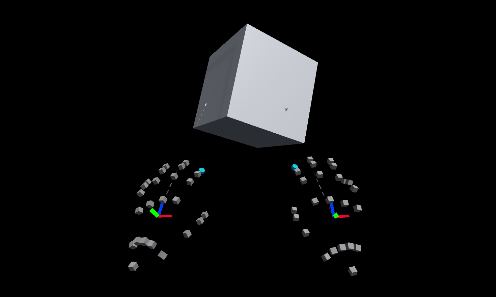
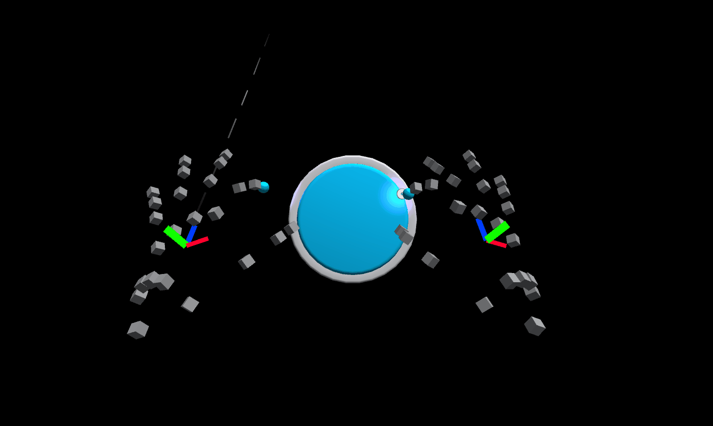
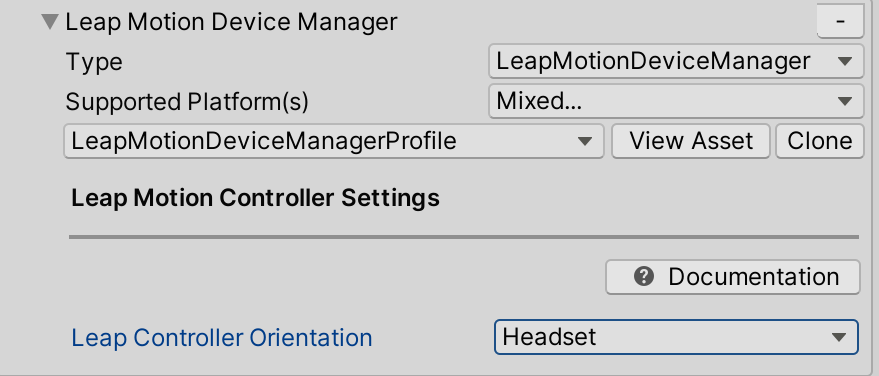
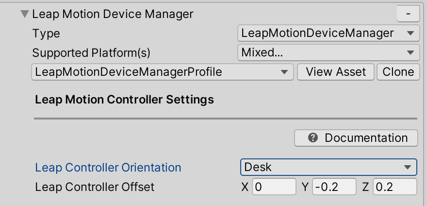

# How to Configure Leap Motion Hand Tracking in MRTK 

A [Leap Motion Controller](https://www.ultraleap.com/product/leap-motion-controller/) is required to use this data provider.

The Leap Motion Data Provider enables articulated hand tracking for VR and could be useful for rapid prototyping in the editor.  The data provider can be configured to use the leap motion controller mounted on a headset or placed on a desk face up.

## Using Leap Motion tracking in MRTK
1. Prepare MRTK project for Leap Motion (REQUIRED)
    - Navigate to Mixed Reality Toolkit > Utilities > Update > Configure CSC File for Leap Motion. Updating the csc file filters out the obsolete warnings produced by the Leap Motion Core Assets.
    

1. Importing the Leap Motion Core Assets
    - Install the [Leap Motion SDK](https://developer.leapmotion.com/releases/?category=orion)
    - Download the [Leap Motion Core Assets](https://developer.leapmotion.com/unity#5436356)
    > [!NOTE]
    > On import of the Leap Core Assets, test directories are removed and 10 assembly definitions are added to the project.

1. Adding the Leap Motion Data Provider
    - Create a new unity scene
    - Add MRTK to the scene by navigating to the **Mixed Reality Toolkit** > **Add to Scene and Configure**
    - Select the MixedRealityToolkit game object in the hierarchy and select **Copy and Customize** to clone the default mixed reality profile.
    
    

    - Select **Clone** in the input system profile to enable modification.

    

    - Open the **Input Data Providers** section, select **Add Data Provider** at the top, a new data provider will be added at the end of the list.  Open the new data provider and set the **Type** to **Microsoft.MixedReality.Toolkit.LeapMotion.Input > LeapMotionDeviceManager**

    

    - The Leap Motion Data Provider contains the `LeapControllerOrientation` property which is the location of the leap motion controller. `LeapControllerOrientation.Headset` indicates the controller is mounted on a headset. `LeapControllerOrientation.Desk` indicates the controller is placed flat on desk. The default value is set to `LeapControllerOrientation.Headset`.  If the orientation is the desk, an extra property `LeapControllerOffset` will appear.  `LeapControllerOffset` is the anchor for the position of the desk leap hands.  The offset is calculated relative to the main camera position and the default value is (0,-0.2, 0.2) to make sure the hands appear in front and in view of the camera.

    
    `LeapControllerOrientation`: Headset (Default) |  `LeapControllerOrientation`: Desk 
    :-------------------------:|:-------------------------:
      |  
     |     

1. Testing the Leap Motion Data Provider
    - After Leap Motion Data Provider has been added to the input system profile, press play, move your hand in front of the Leap Motion Controller and you should see the joint representation of the hand.

1. Building your project 
    - Navigate to **File > Build Settings**
    - Only Standalone builds are supported if using the Leap Motion Data Provider.


## Removing Leap Motion from the Project

1. Close Unity
1. Close Visual Studio, if it's open
1. Open File Explorer and navigate to the root of the MRTK unity project
    - Delete the **UnityProjectName/Library** directory
    - Delete the **UnityProjectName/Assets/LeapMotion** directory
    - Delete the **UnityProjectName/Assets/LeapMotion.meta** file
- Reopen Unity

If errors are logged after reopening, restart unity again.

Debugging

1. Leap Namespace errors missing
2. Obsolete errors 
3. Editor errors


## Getting the hand joints 

Getting joints using the Leap Motion Data Provider is identical to hand joint retrieval for an MRTK Articulated Hand.  For more information, see [Hand Tracking](../Input/HandTracking.md).

The following is a simple example of how to retrieve the pose of the palm joint.
```
using Microsoft.MixedReality.Toolkit.Input;
using Microsoft.MixedReality.Toolkit.Utilities;
using UnityEngine;

public class HandJointsLeap : MonoBehaviour
{
    private GameObject sphere;

    private void Start()
    {
        sphere = GameObject.CreatePrimitive(PrimitiveType.Sphere);
        sphere.transform.localScale = Vector3.one * 0.03f;
    }

    private void Update()
    {
        // If the hand joint pose is available set the position of the sphere to the palm of the right hand
        if (HandJointUtils.TryGetJointPose(TrackedHandJoint.Palm, Handedness.Right, out MixedRealityPose index))
        {
            sphere.transform.position = index.Position;
        }
    }
}
```

## Leap Motion Example Scene

The example scene uses the DefaultLeapMotionConfiguration profile and determines if the unity project has been configured correctly to use the Leap Motion Data Provider.

LeapMotionHandTrackingExample scene location: MRTK/Examples/Demos/HandTracking/.  

## See also

* [Input Providers](../Input/InputProviders.md)
* [Create a Data Provider](../Input/CreateDataProvider.md)
* [Input Simulation](../InputSimulation/InputSimulationService.md)
* [Hand Tracking](../Input/HandTracking.md)
