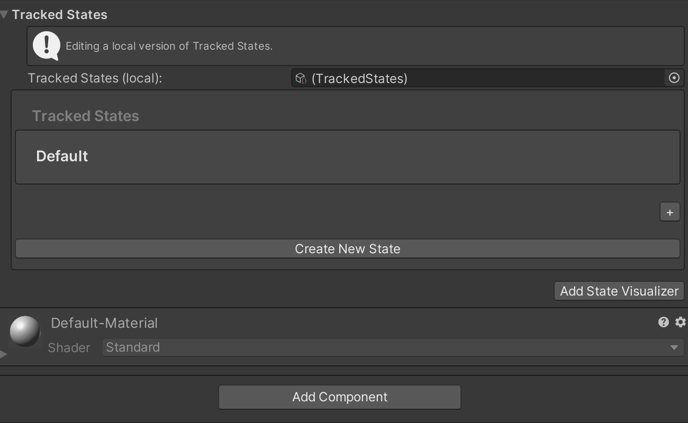

# Interactive Element 

Interactive Element is the next generation of MRTK's Interactable.  An Interactive Element is an object that receives input and fires events depending on the type of input.  The type of input supported is in the form of states and states can have event configurations. 


## Adding a Core States

A CoreInteractionState is a state where the setting logic is already defined.  For example within BaseInteractiveElement the Focus state is set to on when the IMixedRealityFocusHandler's OnFocusOn is called, making the state setting logic already defined.

### How to Add a Core State

#### In-Editor




#### Script


```c#

InteractionState focusState = interactiveElement.AddCoreState(CoreInteractionState.Focus);

```

    